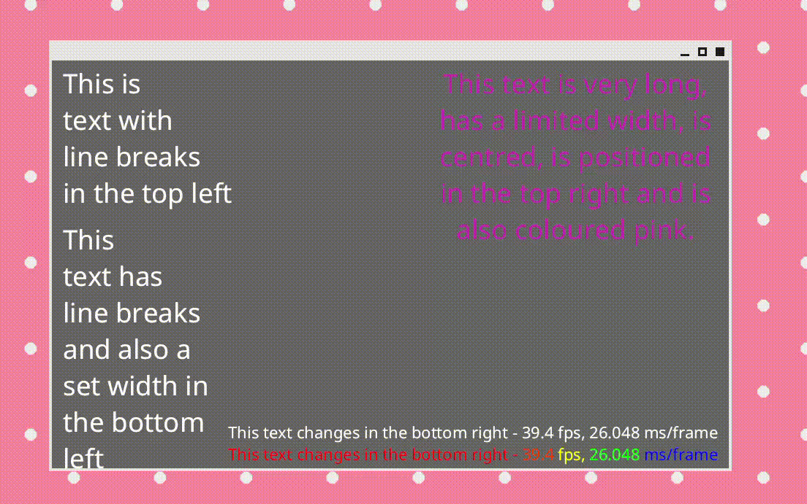

<div align="center">

# 🌷🌷 Bevy x Default Fonts 🌸🌸
*Default font support for the Bevy game engine*



Have you used `Default::default()` on `TextStyle`s? Have you created `Text`es inside of `From` and `Into` trait implementations? Have you crazed yourself when seeing https://github.com/bevyengine/bevy/issues/1017?

Have you be dissapointed that there isn't a way to easily assign the default font in Bevy? 

We're trying to fix that! 😊 `bevy_default_font` is a plugin that allows you to easily assign the default font for UI elements in the Bevy game engine.


</div>

# ✨ Features
- Set the default font that your UI text in Bevy
- You can run `bevy_default` as a:
    - System (runs every frame, thoughh bad performance on production, but it's good if you think you're going to use the UI inspection feature from`bevy-inspector-egui`)
    - Setup System (only runs once so any future `TextStyle`s aren't going to be styled, but this means that it only runs, exactly, once!!)
- It's easy to use too!

```rs
 app.add_plugin(
    DefaultFontPlugin::new(
        |_, server| server.load("NotoSans-Regular.ttf"),
        Mode::Setup,
 ));
```


## 📜 License

Licensed under either of

 * Apache License, Version 2.0, ([LICENSE-APACHE](LICENSE-APACHE) or http://www.apache.org/licenses/LICENSE-2.0)
 * MIT license ([LICENSE-MIT](LICENSE-MIT) or http://opensource.org/licenses/MIT)

at your option.

### 💁 Contribution

Unless you explicitly state otherwise, any contribution intentionally submitted
for inclusion in the work by you, as defined in the Apache-2.0 license, shall be dual licensed as above, without any
additional terms or conditions.